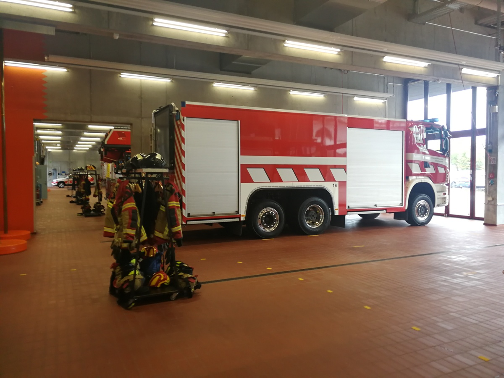
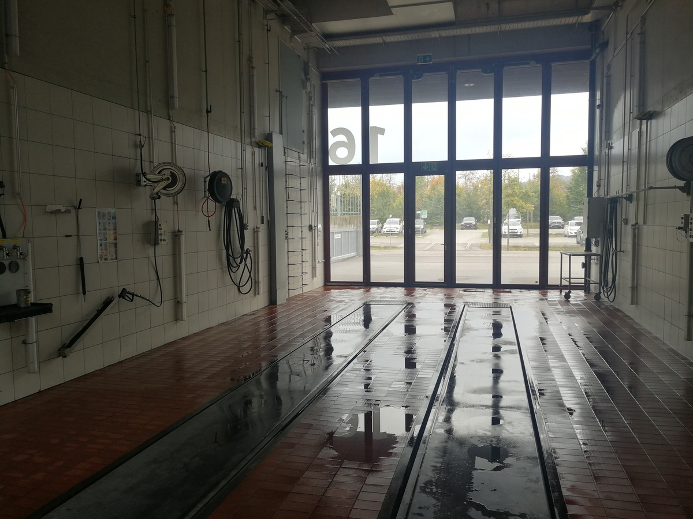
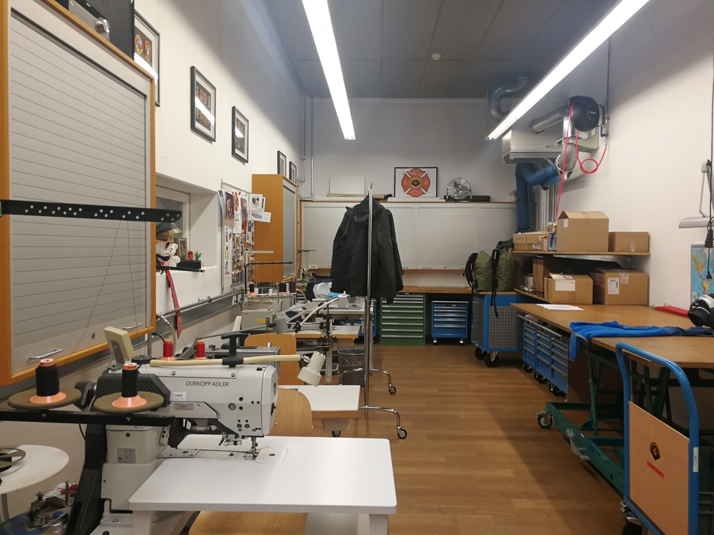
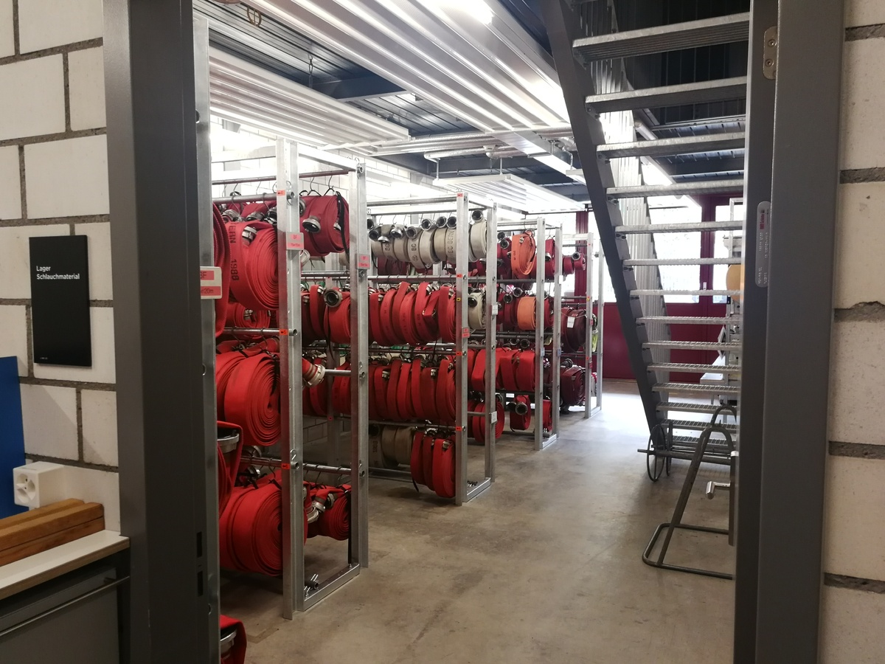
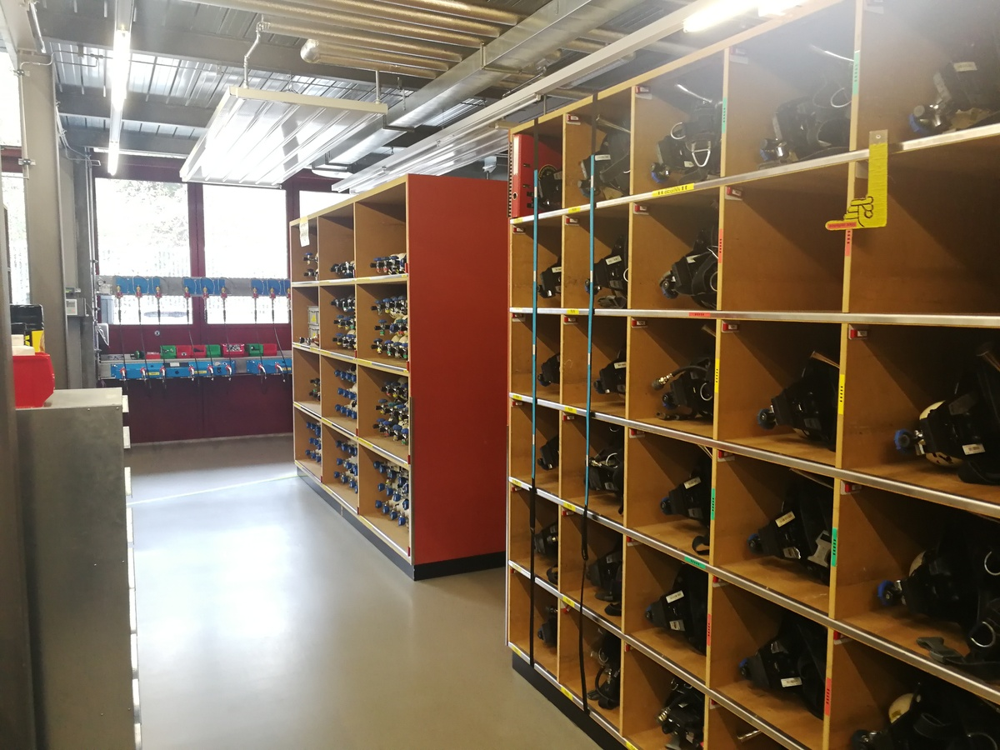

+++
title = "Was hinter den Toren geschieht – zu Besuch bei der Berufsfeuerwehr Bern"
date = "2022-11-30"
draft = false
pinned = false
+++
###### Eine Reportage von Fabrice Bouquet und Linus Kradolfer

## Die Berufsfeuerwehr Bern löscht nicht nur Brände. Diese machen nur ca. 10% der Einsätze der Berufsfeuerwehr aus. Die Berufsfeuerwehrleute sind jedoch nicht ständig im Einsatz. Um zu erfahren, was die Berufsfeuerwehrleute ausserhalb von Einsätzen machen, haben wir die Berufsfeuerwehr Bern besucht.

An einem regnerischen Freitag, kurz vor zwei Uhr nachmittags, finden wir uns im Berner Forsthaus ein. Wir betreten den Haupteingang der grossen Feuerwehrkaserne. Zuvor haben wir uns für eine kleine Führung durch das Gebäude angemeldet. Mit einem Knopfdruck werden wir mit jemandem verbunden, der sagt, dass uns bald die Tür geöffnet wird. Kurz darauf öffnet ein freundlicher Berufsfeuerwehrmann, der sich als Kevin Nideröst vorstellt, die Eingangstür und begrüsst uns. Um eine andere Tür, die in die Fahrzeughalle führt, zu öffnen, muss er seine Hand an einen Handleser halten.

> *«Der Kran ist ein Spielzeug für grosse Jungs»*

##### Ein weitgehend autonomer Betrieb

Als wir die Halle betreten, herrscht nicht viel Betrieb, da gerade noch Mittagspause ist. Uns fällt sofort auf, dass die Temperatur im Gebäude recht hoch ist. Lange verbleiben wir nicht in dieser grossen Fahrzeughalle, sondern wir gehen direkt in den hinteren Teil des Gebäudes. Wir hören die Autobahn, die sich hinter einem schmalen Wäldchen verbirgt. Diese Lage an der Autobahn kommt nicht von ungefähr, so sind die Retter auch schneller in entlegeneren Teilen der Region. Sofern sie nicht ausrücken, arbeiten Berufsfeuerwehrleute unter anderem in einer von mehreren Werkstätten der Berufsfeuerwehr Bern. Die Berufsfeuerwehrleute sind grundsätzlich so in die verschiedenen Werkstätten eingeteilt, dass jeder und jede etwas macht, was mit seinem oder ihrem vorherigen Beruf zu tun hat. Kevin Nideröst zeigt uns zuerst seine Werkstatt, die vorzüglich ausgestattete Schreinerei. «Hier werden unter anderem Türen und andere Holzobjekte repariert.», erklärt uns Kevin Nideröst.  Immer wieder würden hier auch Teile des Mobiliars angefertigt werden, so etwa als die kantonale Einsatzzentrale der Polizei, Feuerwehr und Sanität, kurz KEZ, in den grossen Raum im obersten Stock des Gebäudes eingezogen ist. Damals sei unter anderem ein Holzboden in den ehemaligen Theorieraum der Feuerwehr eingebaut worden, um die zahlreichen Kabel, die benötigt wurden, darunter zu verstauen. Dieser Holzboden sei in dieser Werkstatt entstanden. 

Wir verlassen die Schreinerei und laufen den Gang hinunter zur nächsten Tür. Nun befinden wir uns in der Schlosserei mit dem Lackierwerk. Rechts neben der Tür steht eine grosse Blechwalze. Hier werden hauptsächlich Lackschäden an Fahrzeugen der Berufsfeuerwehr repariert. Um die alte Lackierung zu entfernen, ist das Lackierwerk auch mit einem Sandstrahler ausgestattet. Eine weitere Werkstatt ist für den Unterhalt der Personenfahrzeuge der Berufsfeuerwehr ausgestattet. Der Fahrzeuglift in dieser Werkstatt ist nur für Autos geeignet. Grössere Fahrzeuge können zwar durch die Tore in die Autowerkstatt hineingefahren werden, wenn jedoch bei solchen Fahrzeugen etwas am Unterboden repariert werden muss, müssen sie in die Waschanlage, die sogenannte Lavage, gefahren werden, wo sich der grosse Fahrzeuglift befindet. 

Als wir später zur Waschanlage gehen, die von beiden Seiten durch Tore befahrbar ist, sind der Boden und der grosse Lift noch nass von der letzten Benutzung der Lavage. Kevin Nideröst erzählt uns, dass die Berufsfeuerwehrleute gegen eine jährliche Pauschale, die alle zahlten, die Waschanlage und den Autolift in der Autowerkstatt auch privat benutzen dürften. Ausserdem könnten die Berufsfeuerwehrleute zu einem leicht tieferen Preis als an normalen Tankstellen an der hauseigenen Tankstelle ihre Autos tanken.

##### Zukunftsmusik

Kevin Nideröst erzählt uns, es sei geplant, die Pikettdienstautos der Berufsfeuerwehr schon bald durch Elektrofahrzeuge zu ersetzen. Angesprochen auf das Brennverhalten von Elektrofahrzeugen antwortet Kevin Nideröst, dass das Löschen nicht gross anders als bei Fahrzeugen mit konventionellen Motoren sei. «In Übungen werden wir im richtigen Umgang mit verunfallten Elektrofahrzeugen geschult. Wenn die Akkus von Elektrofahrzeugen zum Beispiel nach einem Unfall beschädigt sind, kann es in seltenen Fällen vorkommen, dass sie sich spontan entzünden oder nach dem Löschen wieder zu brennen beginnen. Um mit diesem Problem umzugehen, hat die Berufsfeuerwehr Verträge mit Abschleppdiensten, die spezielle Container zu Unfallstellen liefern.» Mit diesen Containern werden verunfallte Elektrofahrzeuge abgeschirmt. Falls die Akkus zu brennen beginnen, können diese Container mit Wasser geflutet werden. Den Grossteil des Fahrzeugparks mit Elektrofahrzeugen zu ersetzen sei im Moment kein Thema. Kevin Nideröst erzählt uns, dass es zwar Lastwagen mit Elektroantrieb gebe, diese jedoch grosse Akkus eingebaut hätten, und es dadurch schwieriger sei, auf solchen Fahrzeugen Ausrüstung und Werkzeugen zu transportieren. Zudem sei bei solchen elektrischen Tanklöschfahrzeugen die Wasserpumpe mit einem Dieselmotor betrieben, somit sei lediglich der Fahrantrieb elektrisch geregelt. Deshalb wären wahrscheinlich wasserstoffbetriebene Lastwagen die beste Option für den Umstieg auf erneuerbare Energien. Angesprochen darauf, wie die Berufsfeuerwehr mit brennenden Wasserstofffahrzeugen umgeht, antwortet Kevin Nideröst, dass die Berufsfeuerwehr bis jetzt noch keinen Einsatz mit Wasserstofffahrzeugen gehabt habe. «Schulungen zum Umgang mit solchen Fahrzeugen sind erst für nächstes Jahr angesagt», sagt Kevin Nideröst.

##### Unter Druck

Nach dem Anschauen der Werkstätten und der Waschanlage laufen wir zur Sattlerei. Auf dem Weg dorthin herrscht auf einmal wieder reger Betrieb, denn die Mittagspause ist nun vorbei. Berufsfeuerwehrmänner laufen uns entgegen, grüssen uns. Die Sattlerei ist ein kleiner Raum, verglichen mit den vorher erwähnten Werkstätten. In der Sattlerei wird die Schutzausrüstung der Berufsfeuerwehrmänner, wie Schuhe, Helme und Brandschutzbekleidung, repariert.

Als Nächstes schauen wir uns das Schlauchlager an. Es befindet sich auf derselben Seite des Gebäudes wie die Schreinerei, die Autowerkstatt und die Schlosserei. Im Schlauchlager befinden sich viele aufgerollte Schläuche, die für Löscheinsätze unentbehrlich sind. Mit einer Maschine werden die Schläuche geputzt und gleichzeitig mit einem Wasserdruck von 16 Bar getestet. «Trotzdem kann es im Einsatz passieren, dass ein Schlauch platzt», erzählt Kevin Nideröst.

Der Raum, in dem die Atemschutzgeräte gelagert werden, besteht aus einem Teil, in dem Wartungen an den Geräten vorgenommen werden, und aus Regalen mit den Atemschutzgeräten. Am hinteren Ende der Regale werden die Pressluftflaschen an Kompressoren angeschlossen und gefüllt. Die Schläuche, mit denen man die Pressluftflaschen befüllt, sehen sehr ähnlich aus wie die, die man zum Befüllen von Pressluftflaschen beim Tauchen benutzt. Im Atemschutzgerätlager ist ein simples, aber dennoch cleveres System im Einsatz, um zu gewährleisten, dass alle Atemschutzgeräte benutzt werden. Dabei wird ein Pfeil am Regal mit den Atemschutzgeräten entlang verschoben, der anzeigt, welche Geräte benutzt werden müssen. So wird sichergestellt, dass alle Geräte innerhalb eines bestimmten Zeitraums einmal benutzt werden. Somit werden auch allfällige Defekte an den Atemschutzgeräten entdeckt.

##### Der Kran – Ein besonderes Fahrzeug

Auf dem Rückweg zum Haupteingang laufen wir durch die Haupthalle, wo die Fahrzeuge der Berufsfeuerwehr stehen. «Der Kran ist mein Lieblingsfahrzeug, da er gross und vielseitig einsetzbar ist. Er ist fast wie ein Spielzeug für grosse Jungs», erklärt uns Kevin Nideröst. Genau dieser Kran habe er bei seinem letzten Einsatz eingesetzt. «Mein letzter Einsatz war eine Grosstierrettung. Ein Kalb war in eine Güllegrube gefallen und wir mussten es herausheben», führt Kevin Nideröst aus. «Um das Kalb am Kran zu befestigen, musste ihm zuerst ein sogenanntes Grosstierrettungsnetz angezogen werden. Dazu mussten wir hinab in die Güllegrube steigen. Zum Schutz vor der Gülle und den Gasen in der Güllegrube haben wir Trockentauchanzüge mit Handschuhen und Stiefeln zusätzlich zum Atemschutzgerät getragen», erklärt uns Kevin Nideröst. Mit dieser Schutzausrüstung merke man gar nicht viel von der Gülle. Man wisse zwar, dass man in der Gülle sei, doch man rieche nichts. Als das Rettungsnetz schliesslich befestigt gewesen sei, sei das Kalb mit dem Kran aus der Güllegrube gehoben worden.

> *«Berufsfeuerwehrmänner sind dazu verpflichtet, fit zu sein.»*

##### Allzeit bereit

Nach unserem Rundgang führt uns Kevin Nideröst zu einem kleinen Zimmer, wo wir ihm einige Fragen stellen.

 Kevin Nideröst sei gerade aus den Ferien zurückgekommen, deshalb würde er sich über einen Einsatz freuen. Am heutigen Tag sei noch nichts los gewesen, erklärt er uns. Das sei aber nicht immer so. Während manchen Schichten gebe es mehrere Einsätze, unter anderem auch mitten in der Nacht. Diese Schichten seien sehr anstrengend und der freie Tag nach der 24-stündigen Schicht brauche man dann, um sich auszuruhen. Wenn kein Einsatz sei, würden die Berufsfeuerwehrleute auch mal einen Filmabend veranstalten. Natürlich müssten sie aber jederzeit bereit sein auszurücken. 

Ein Berufsfeuerwehrmann braucht viel Wissen und Können, um seinen Beruf ausüben zu können. Ausserdem ist dieser Beruf körperlich anstrengend. Auf die Frage, wie lange man den Beruf ausüben könne, antwortet Kevin Nideröst, dass die meisten Berufsfeuerwehrleute bis zur Pension arbeiten. Die Zukunft werde es zeigen, aber bis jetzt rechne Kevin Nideröst damit, bis zur Pension bei der Berufsfeuerwehr zu arbeiten. «Um fit zu bleiben, haben wir in jeder Schicht eine Stunde bezahlten Sport, die wir nutzen, um entweder in den Fitnessraum der Berufsfeuerwehr zu gehen oder in der Turnhalle Mannschaftssport zu betreiben. Wir sind auch dazu verpflichtet, fit zu sein, um in Einsätzen unsere Arbeit richtig verrichten zu können», erklärt uns Kevin Nideröst. 

Als wir Kevin Nideröst fragen, ob er denn mit dem Gebäude der Berufsfeuerwehr zufrieden sei, antwortet er grinsend, dass das Gebäude zuerst noch einige Mängel aufgewiesen habe. So sei zum Beispiel der Ablauf bei der Waschanlage nicht der tiefste Punkt in jener gewesen. Dadurch habe das Wasser nicht zuverlässig ablaufen können. Weiter erklärt er, dass es im Gebäude immer warm sei, da es nach Minergie-Standards gebaut worden sei. Aber jetzt sei er im Großen und Ganzen zufrieden mit der modernen Ausstattung, die das 2014 eingeweihte Gebäude habe. Die Berufsfeuerwehr existiert jedoch schon viel länger. Die erste Vorgängerin der Berufsfeuerwehr der Stadt Bern, das Brandcorps, entstand schon im Jahre 1908. Damals war zwar nur ein Feuerwehrmann beschäftigt, dieser arbeitete jedoch Vollzeit.  Heute ist das Brandcorps ein Teil der Milizfeuerwehr der Stadt Bern, welche die Berufsfeuerwehr bei Bedarf unterstützt. 

Schliesslich kommt unser Besuch bei der Berufsfeuerwehr zu seinem Ende. Kevin Nideröst begleitet uns wieder zum Haupteingang zurück, wo wir unseren Rundgang gestartet haben. Wir verabschieden uns von ihm und verlassen das Gebäude. Reich an Eindrücken und begeistert über die Einblicke in das imposante Gebäude entfernen wir uns von diesem.

#### 

Kevin Nideröst ist vor seiner Karriere bei der Berufsfeuerwehr Schreiner gewesen. 
Die Vorhersehbarkeit des Alltags in der Schreinerei ist ihm mit der Zeit zuwider 
geworden. Als seine Schreinerei eines Tages einen Auftrag für den Bau des neuen 
Hauptquartiers der Berufsfeuerwehr Bern bekommen hat, hat er vor Ort gearbeitet 
und ihm ist die Idee gekommen, sich bei der Berufsfeuerwehr zu bewerben.
Einige Zeit später, als ihm der Alltag zu Kopfe gestiegen ist, hat er sich 
erfolgreich beworben und ist in den Ausbildungsprozess zum Berufsfeuerwehrmann
aufgenommen worden. Nach der Zusage hat er die Lastwagenprüfung absolviert,
die für Berufsfeuerwehrleute Pflicht ist. Vor seiner Ausbildung zum
Berufsfeuerwehrmann ist er nie Teil einer Milizfeuerwehr gewesen, was für
ihn kein grosser Nachteil gewesen ist, weil man in der anderthalbjährigen
Ausbildung zum Berufsfeuerwehrmann alles Wichtige von Grund auf lernt, 
daher ist eine Mitgliedschaft in einer Milizfeuerwehr auch kein Kriterium für
eine Aufnahme in die Berufsfeuerwehr. Mittlerweile arbeitet Kevin Nideröst 
seit vier Jahren bei der Berufsfeuerwehr Bern und ist von der Abwechslung 
im Arbeitsalltag begeistert.

